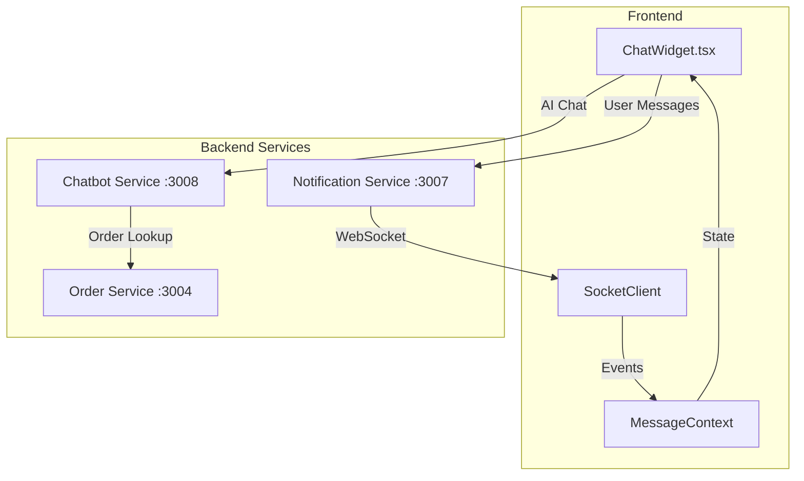
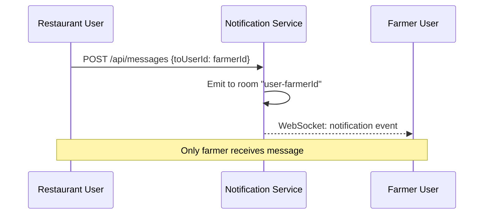

# Farm2Table Chatbot Architecture

## Overview

The Farm2Table chatbot provides AI-powered assistance and real-time user-to-user messaging. It operates across multiple services with secure message routing.

## Architecture Diagram



## Services Involved

| Service | Port | Role |
|---------|------|------|
| `chatbot-service` | 3008 | Intent detection, AI responses, order info |
| `notification-service` | 3007 | WebSocket server, message routing |
| `order-service` | 3004 | Order lookup by number/ID |

## Communication Flow

### 1. AI Chat Mode
```
User → ChatWidget → POST /api/chat → chatbot-service
                                          ↓
chatbot-service → Detects intent → Fetches order data
                                          ↓
                           Returns response + quick replies
```

### 2. User-to-User Messaging
```
Sender → ChatWidget → POST /api/messages → notification-service
                                                    ↓
notification-service → Emits WebSocket event to recipient's room
                                                    ↓
Recipient's SocketClient → MessageContext → Updates UI
```

## Security Model

### Message Targeting
Messages are **never broadcast**. They are routed using Socket.io rooms:

```javascript
// Each user joins their own room on connection
socket.join(`user-${userId}`);

// Messages emit only to target user's room
io.to(`user-${targetUserId}`).emit('notification', data);
```

### Room Structure
- `user-{userId}` - Private room for each user
- `role-{role}` - Role-based rooms (farmer, restaurant, distributor)

### Why Messages Don't Go to Wrong Users
1. **Server-side targeting**: Notification service emits to specific `user-{id}` room
2. **No wildcards**: Messages are never broadcast to all clients
3. **Validation**: Each message includes `fromUserId` and `toUserId`
4. **Frontend filtering**: MessageContext filters by `toUserId === currentUserId`

## Data Flow Security



## Message Storage

- **Frontend**: `localStorage` persists messages client-side
- **Context**: `MessageContext` manages message state
- **No Backend DB**: Messages are not stored server-side (ephemeral)

## WebSocket Events

| Event | Direction | Purpose |
|-------|-----------|---------|
| `join` | Client → Server | Join user's room |
| `joined` | Server → Client | Confirm room membership |
| `notification` | Server → Client | Deliver all notification types |

### Notification Types
- `chat_message` - Direct message to user
- `chat_message_sent` - Confirmation to sender
- `order` / `order_update` - Order notifications
- `delivery` - Delivery status updates

## Frontend Components

### ChatWidget.tsx
- Dual-mode: AI assistant or user-to-user chat
- `chatContext` state manages current conversation
- Sends to `/api/chat` (AI) or `/api/messages` (direct)

### MessageContext.tsx
- Global message store (React Context)
- Listens for `chat_message` WebSocket events
- Calculates `unreadCount` filtered by `currentUserId`

### MessageInboxBadge.tsx
- Badge shows unread count in navbar
- Click opens ChatWidget with conversation

### SocketClient.ts
- Singleton WebSocket connection manager
- Queues listeners registered before connection
- Auto-reconnects on disconnect

## API Endpoints

### Chatbot Service (`/api/chat`)
```typescript
POST /api/chat
Body: { message: string, userId: string }
Response: { intent, response: { text, quickReplies, data } }
```

### Notification Service (`/api/messages`)
```typescript
POST /api/messages
Body: {
  fromUserId, toUserId, message,
  orderId, orderNumber,
  senderName, senderRole
}
```

## Intent Detection

The chatbot detects these intents:
- `TRACK_ORDER` - Order status lookup
- `CHAT_WITH_PARTY` - Connect to farmer/distributor/restaurant
- `FIND_PRODUCTS` - Product search
- `GET_HELP` - General assistance
- `UNKNOWN` - Fallback

Priority matching: `CHAT_WITH_PARTY` with order number is checked first to prevent misclassification.
